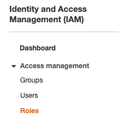

# Deploying the Chime Voice connector Transcription

The first step is to deploy the Amazon Chime Voice Connector transcription solution located here [_https://github.com/aws-samples/amazon-chime-voiceconnector-transcription_](https://github.com/aws-samples/amazon-chime-voiceconnector-transcription)

There are 2 options for this solution, for cases where your transcription length is lower than 15 minutes, you have the Lambda option, and, for cases where your transcriptions are longer than 15 minutes you can use the container based option.

In this case, the requirement is to have calls longer than 15 minutes (which is the current lambda [_execution time limit_](https://docs.aws.amazon.com/lambda/latest/dg/gettingstarted-limits.html)).

For deploying this solution you can either do it from your local computer or from an EC2 instance.

You will use a EC2 instance to deploy the solution, follow the steps mentioned in the github repo from a "Amazon Elastic Cloud Compute (EC2)” instance, you will use Amazon Linux 2 as the base images, and t2.medium as machine type. (i do not think t2.medium. If you want to learn about how to launch a new EC2 instance you can go [_here_](https://docs.aws.amazon.com/AWSEC2/latest/UserGuide/LaunchingAndUsingInstances.html).

If you decide to use an EC2 instance to deploy this solution, please remember to terminate when you are done to avoid unnecessary charges.


### Configuring the IAM User

In order to build this solution you need to gran certain permissions to the EC2 instance we are using. 

An IAM role is an IAM entity that defines a set of permissions for making AWS service requests. IAM roles are not associated with a specific user or group. Instead, trusted entities assume roles, in our case our EC2 instance will assume a role with a set of permissions.

The policy document we are going to attach to our role is the following:

[_https://github.com/aws-samples/amazon-chime-voiceconnector-transcription/blob/master/permission/policy.json_](https://github.com/aws-samples/amazon-chime-voiceconnector-transcription/blob/master/permission/policy.json)

Follow these steps:

1. Go to IAM in the AWS console and click on policies:


2. Click on create policy:


3. Click on the Json tab and paste the contents of the [_policy_](https://raw.githubusercontent.com/aws-samples/amazon-chime-voiceconnector-transcription/master/permission/policy.json):

```
{
    "Version": "2012-10-17",
    "Statement": [`
        {`
            "Sid": "VisualEditor0",
            "Effect": "Allow",
            "Action": [
                "apigateway:*",
                "autoscaling:Attach*",
                "autoscaling:Create*",
                "autoscaling:Describe*",
                "autoscaling:Update*",
                "cloudformation:Create*",
                "cloudformation:Describe*",
                "cloudformation:Execute*",
                "cloudformation:Get*",
                "cloudformation:List*",
                "cloudformation:Update*",
                "dynamodb:Create*",
                "dynamodb:Describe*",
                "dynamodb:Get*",
                "dynamodb:List*",
                "dynamodb:Update*",
                "ec2:Associate*",
                "ec2:Attach*",
                "ec2:Authorize*",
                "ec2:Create*",
                "ec2:Describe*",
                "ec2:Get*",
                "ec2:Import*",
                "ec2:Modify*",
                "ec2:RunInstances",
                "ecr:Create*",
                "ecr:Describe*",
                "ecr:Get*",
                "ecr:List*",
                "ecr:Put*",
                "ecs:Create*",
                "ecs:Describe*",
                "ecs:List*",
                "ecs:Register*",
                "events:Describe*",
                "events:List*",
                "events:Put*",
                "iam:Add*",
                "iam:Attach*",
                "iam:Create*",
                "iam:Get*",
                "iam:List*",
                "iam:PassRole",
                "iam:Put*",
                "iam:Update*",
                "lambda:AddPermission",
                "lambda:Create*",
                "lambda:Get*",
                "lambda:List*",
                "lambda:Publish*",
                "lambda:Put*",
                "lambda:Update*",
                "logs:Create*",
                "logs:Describe*",
                "logs:Get*",
                "logs:List*",
                "logs:Put*",
                "s3:Create*",
                "s3:Describe*",
                "s3:Get*",
                "s3:List*",
                "s3:Put*",
                "sqs:Create*",
                "sqs:Get*",
                "sqs:List*",
                "sqs:Set*",
                "ssm:DescribeParameters",
                "ssm:GetParameters",
            ],
            "Resource": "*"
        }
    ]
}
```


4. Click on “Review policy”.

5. Enter a name for your new policy and click on “Create policy”


6. Click on Roles



7. Click on Create role:


8. Select AWS Service and EC2, and then click “Next: Permissions::


9. Search and mark your recently created policy, and click on “Next:Tags”:


10. Insert your tags if you need and click on “Next: Review”

11. Enter a name for your role and click on “Create Role”:


12. Go to your EC2 dashboard and select the instance you are using to deploy the solution, then, click on Actions, Instance Settings, Attach/Replace IAM Role:


13. Select the role you just created and click apply.


14. If everything went as expected you will see the following screen and we can proceed to login into our ec2 instance for the next steps:


### Downloading the project artifacts

### 

For the next portion of the process, login into your EC2 instance, if you haven’t had a chance to do it yet, please review this [_arcticle_](https://docs.aws.amazon.com/AWSEC2/latest/UserGuide/AccessingInstances.html).

1. Execute: aws configure, since you already have a role attached to your instance you won’t need to supply an AWS Access Key ID nor a Secret Access key, you will only provide our default region, which in this case is us-east-1:


2. Create a new directory:

```
mkdir audiodemo
cd audiodemo
```

3. Download the Cloudformation template and the required artifacts:

`wget https://github.com/aws-samples/amazon-chime-voiceconnector-transcription/releases/download/v0.16.0/deployment-template.json`

`wget https://github.com/aws-samples/amazon-chime-voiceconnector-transcription/releases/download/v0.16.0/amazon-chime-voiceconnector-recordandtranscribe.zip`

4. Afterwards, you need your accountID, there are several ways to obtain in like for example on the console by clicking on your user name on the top right corner, in this case I’m doing it from the instance itself (you can research more about instance metadata [_here_](https://docs.aws.amazon.com/AWSEC2/latest/UserGuide/instancedata-data-retrieval.html)). The command is the following:

`curl `[`http://169.254.169.254/latest/dynamic/instance-identity/document`](http://169.254.169.254/latest/dynamic/instance-identity/document)


5. You are going to create a S3 bucket to upload your lambda code, keep in mind that S3 bucket names are a Universal Namespace, this means that your name needs to be unique (hence the reason why we are using our account number as an identifier). Replace <accountid> for your account number and execute the following command:

`aws s3api create-bucket --bucket source-us-east-1-**<**`**`accountid`**`**>** --region us-east-1`


6. Next step will be to copy the local artifacts to our S3 bucket, one more time, remember to replace your <accountid>:

aws cloudformation package --template-file deployment-template.json --s3-bucket source-us-east-1-**<accountid>** --force-upload --use-json --output-template-file packaged.json


7. Finally you are going to deploy the cloudformation template, remember that in this case we are going to deploy the Container based solution, in case you want to deploy the Lambda based solution you will need to use “SolutionType=LAMBDA”

`aws cloudformation deploy --template-file packaged.json --stack-name CallAudioDemo --capabilities CAPABILITY_IAM --region us-east-1 --parameter-overrides ``SolutionType``=ECS`
