# Deploying the Chime Voice connector Agent Assist Solution

Now that you have the Amazon Chime Transcription solution installed, we can move ahead and setup the Agent Assist solution.

In order to get started you will need to satisfy some requirements for your development environment, which in my case, is an ec2 instance.

Also, because you will be hosting the web interface with [_AWS Amplify_](https://aws.amazon.com/amplify/) you will need a repository setup.

Also, you will need to install jq.

### Installing nvm and npm

1. Install [_nvm_](https://github.com/nvm-sh/nvm) and [_npm_](https://www.npmjs.com/get-npm)

2. For installing NVM, follow the instructions available on their github repo:

`wget -qO- https://raw.githubusercontent.com/nvm-sh/nvm/v0.35.3/install.sh | bash`

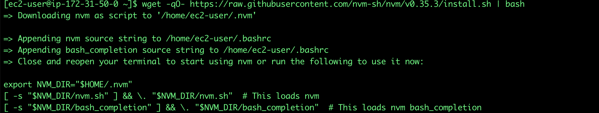

3. After nvm is installed, logout and log back to simulate the terminal restart.

4. To install npm run:

`nvm install node`

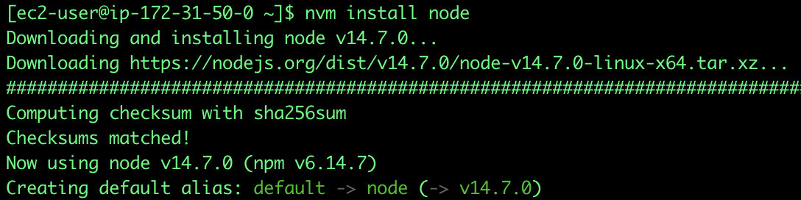

### Installing the AWS Amplify CLI

The Details about how to deploy the amplify console can be found on AWS Amplify’s [_documentation site_](https://docs.amplify.aws/cli/start/install).

In summary, what you need to do is to configure your console and also create a user with the AdministratorAccess permissions to provision the AWS resources needed by the Agent Assist solution to run.

1. Download and install the Amplify CLI:

`npm install -g @aws-amplify/cli`

2. Follow the install steps that will be proposed after running the following command:

`amplify configure`

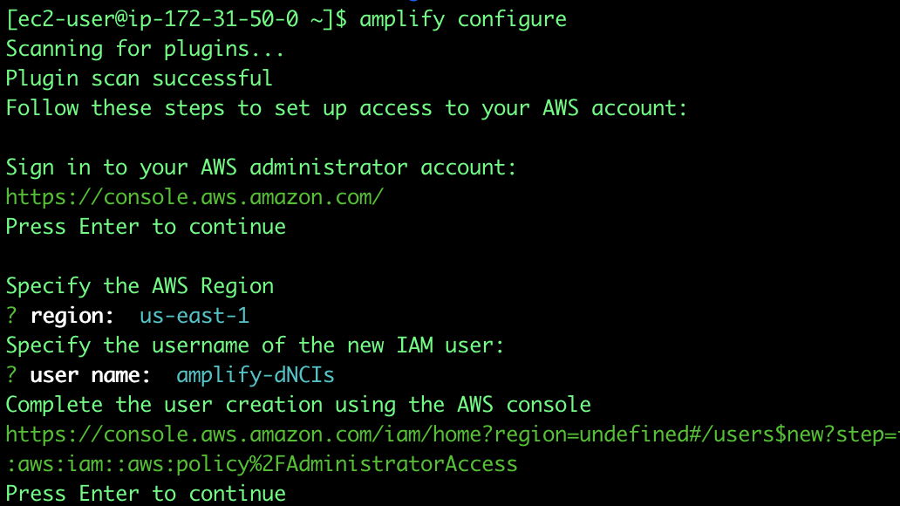

Essentially, here you will define the region where your user will be created and the username, this will generate an URL that will take you the AWS console to provision the user.

All the settings will be predefined, so just move through the user creation process without making any changes.

3. After the new user is created, you will be presented with the Access key ID and the Secret Access key, which you will have to enter on the Amplify configuration script:

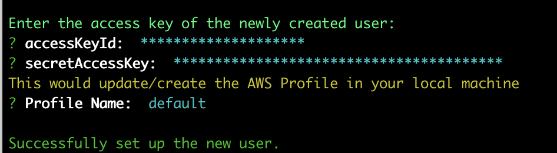

### Installing jq

1. To install [_jq_](https://stedolan.github.io/jq/), run the following command:

`sudo yum install jq -y`

### Installing git and cloning the solution repository

1. Clone the solution repo, if you don't have git installed, install it with the following command:

`sudo yum install git -y`
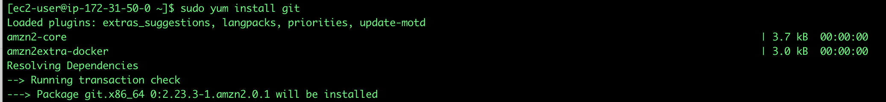

2. Clone solution repository:

`git clone https://github.com/aws-samples/chime-voiceconnector-agent-assist.git`
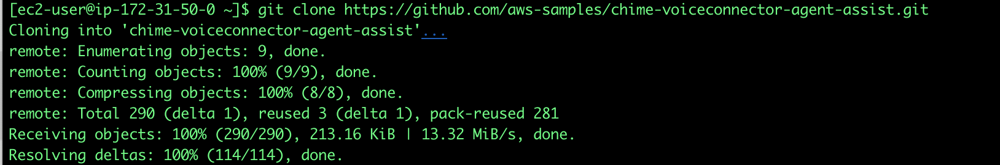

### Installing the package and dependencies

1. After the repo has been cloned, go to the newly created directory and run the npm install command.

`cd chime-voiceconnector-agent-assist`
`npm install`


### Initializing and pushing  the AWS Amplify Project

1. Under the chime-voiceconnector-agent-assist directory, execute the following command:

`amplify init`
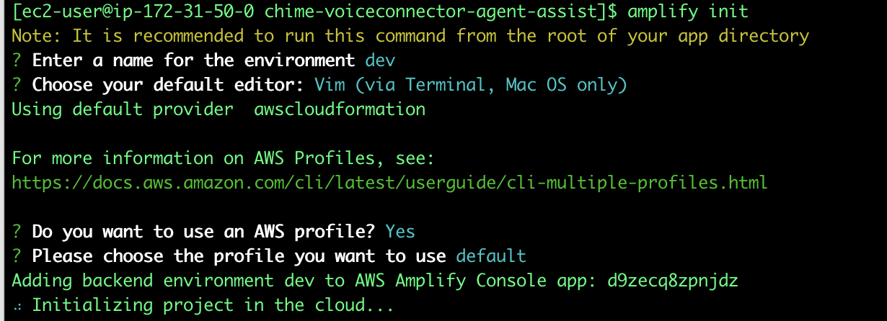

2. Now that your amplify project has been initialized, push the infrastructure to the cloud by executing the following command:

`amplify push`
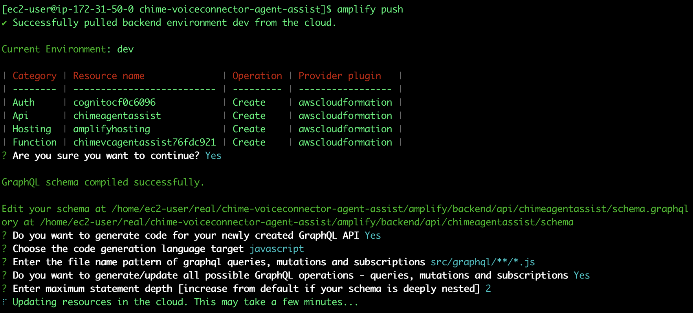

3. After this process you will see a message similar to this:

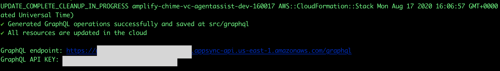

4. Now its time to push the Search infrastructure to the cloud, execute the following command:

`chmod u+x ./infrastructure/deploy_search_infrastructure.sh && ./infrastructure/deploy_search_infrastructure.sh`
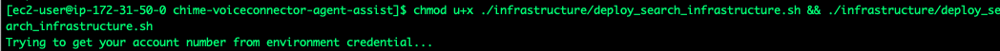

5. Keep in mind that deploying an [_Elasticsearch_](https://aws.amazon.com/elasticsearch-service/) cluster may take several minutes, once the process is finished you will see a message similar to this:

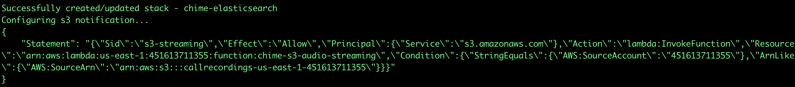

6. Finally, after the search infrastructure has been deployed, pull the environment config and publish the frontend to the cloud. This process may take a long time, if your ssh session gets terminated, check the status of the chime_elasticsearch stack on your CloudFormation console.

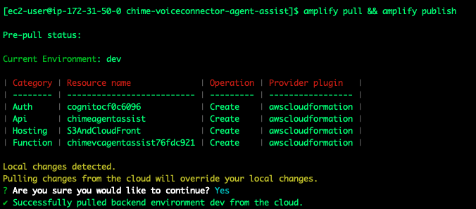
`amplify pull && amplify publish`

7. After the publishing process is finished, you will get a message stating that our deployment has been completed and you will get the url for the solution.

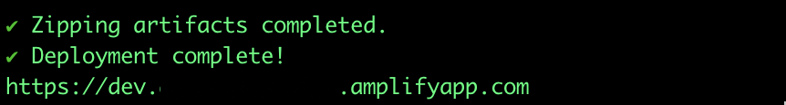
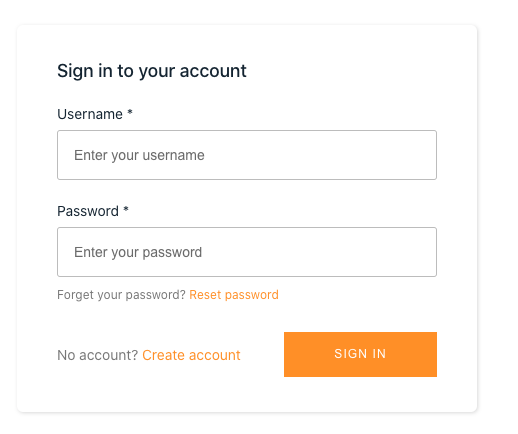

8. Now you need to create an account, we can do it by clicking on the Create account link next to the “Sign In” button.

9. After filling the form you will get a confirmation number that will be used to activate your account. This task is achieved by Amazon Cognito, you can find more information [_here_](https://docs.aws.amazon.com/cognito/latest/developerguide/signing-up-users-in-your-app.html).

### Enabling the trust relationship for the auth user role

In this setp you willl modify the IAM role assigned to the authorized users to be able to be used by Cognito.

1. On the IAM console, search for "auth" and click for the Auth role:

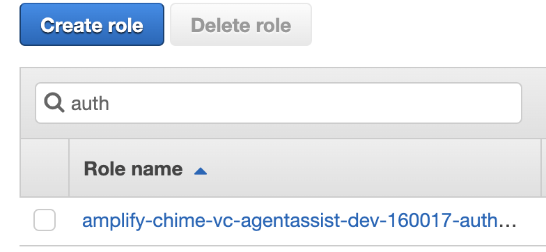

2. Click on the Trust relationships tab and then on the "Edit trust relationship" button.

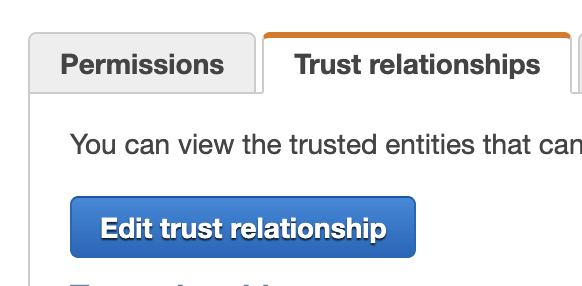

3. Modify the trust policy so the Effect is "Allow", it should look like this:

```
{
    "Version": "2012-10-17",
    "Statement": [
        {
            "Sid": "",
            "Effect": "Allow",
            "Principal": {
                "Federated": "cognito-identity.amazonaws.com"
            },
            "Action": "sts:AssumeRoleWithWebIdentity"
        }
    ]
}
```

4. Click on Update Trust policy and it will look like this:

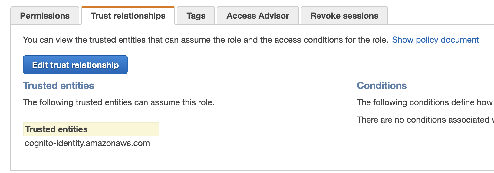


### Creating the Cognito User Group

In order to get access to AWS resources from the Authenticated users, you need to create a Group, this way an IAM role can be assigned to them, to learn more, check [Amazon Cognito Documentation](https://docs.aws.amazon.com/cognito/latest/developerguide/role-based-access-control.html)

1. Log into the AWS console and go to Cognito, in there click on "Manage User Pools".

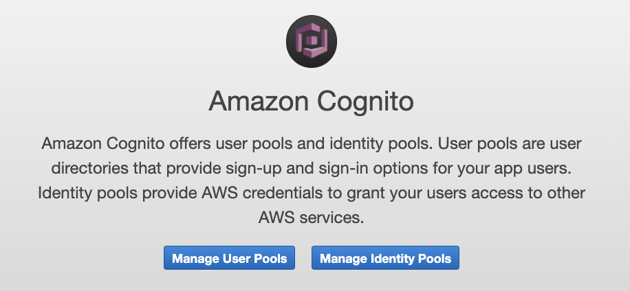

2. Then select the User pool created by our Cloud Formation Template:

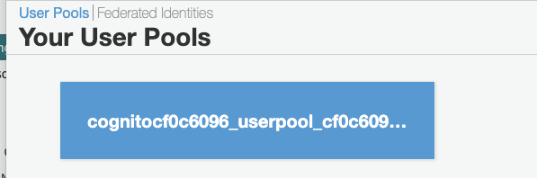

3. Choose the group tab and then click on "Users and Groups", and then on "Create Group":

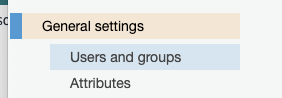
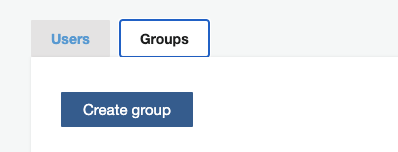

4. Click on Create group and Enter a name and choose the IAM Role that starts with amplify-chime-vc and ends with AuthGroup

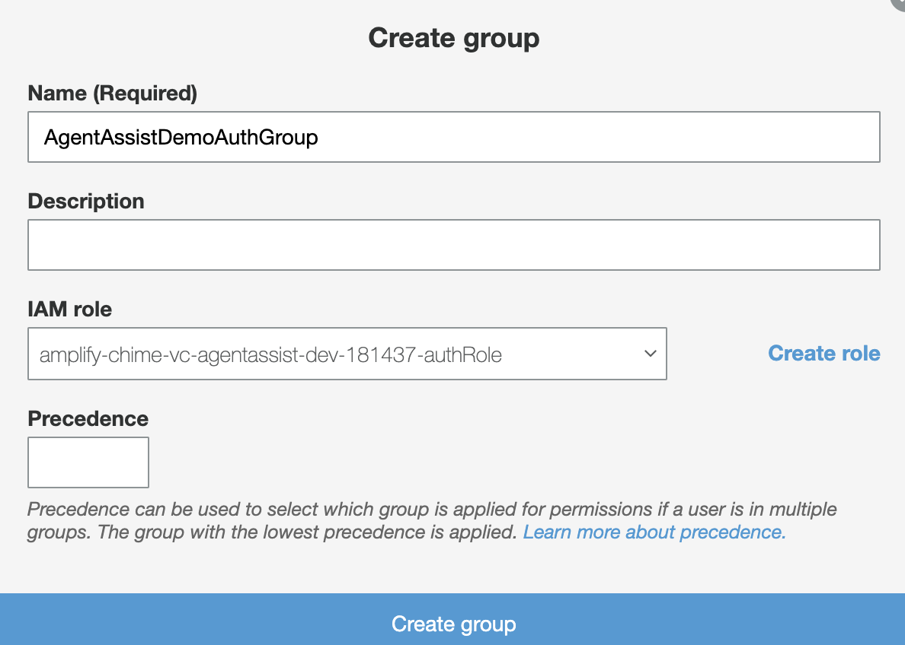

5. Go back to the Users Tab and click on the username you just created.

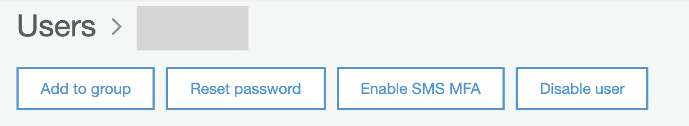

6. Click on Add to group and select the group we just created, and click on the "Add to group" button:

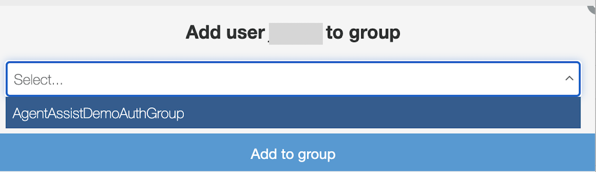
