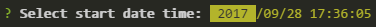

# inquirer-datepicker

> Datepicker plugin for [Inquirer.js](https://github.com/SBoudrias/Inquirer.js)
>
> 
>
> [![NPM Version][npm-image]][npm-url]
> [![Download Status][download-image]][npm-url]
> [![Dependencies][david-image]][david-url]

### Getting started

###### install plugin

[](https://nodei.co/npm/inquirer-datepicker/)

###### register prompt

```javascript
inquirer.registerPrompt('datepicker', require('inquirer-datepicker'));
```

### Options

###### message

Inherited from inquirer, message to be displayed while retrieving response.

###### format

An array of format specifiers for printing the date to the console.

Uses the [moment](https://github.com/moment/moment) format options.

For example:

```Javascript
// 2017/09/26 22:56:36
{
  type: 'datepicker',
  name: 'date',
  message: 'Select a date time: ',
  format: ['Y', '/', 'MM', '/', 'DD', ' ', 'HH', ':', 'mm', ':', 'ss']
}

// 2017/09/26 10:56:36 PM
{
  type: 'datepicker',
  name: 'date',
  message: 'Select a date time: ',
  format: ['Y', '/', 'MM', '/', 'DD', ' ', 'hh', ':', 'mm', ':', 'ss', ' ', 'A']
}
```

###### default

Initial value for datepicker.

Example:

```javascript
{
  type: 'datepicker',
  name: 'date',
  message: 'Select a date time: ',
  default: new Date('2017-09-28 17:36:05'),
}
```

###### min, max

These specify a range for entry. Users will be prohibited from entering a value higher or lower.

```Javascript
{
  type: 'datepicker',
  name: 'date',
  message: 'Select a date time: ',
  // Enter only 2017/9/1 6:00 to 2017/9/26 18:00
  min: {
    year: 2017,
    month: 9,
    day: 1,
    hour: 6
  },
  max: {
    year: 2017,
    month: 9,
    day: 26,
    hour: 18
  }
}
```

###### steps.{ years, months, days, hours, minutes, seconds }

These specify the allowed interval (modulo), but only work when useing up and down keys.

For instance:

```Javascript
// Minutes can only be entered in intervals of 15 minutes
{
  type: 'datepicker',
  name: 'date',
  message: 'Select a date time: ',
  steps: {
    minutes: 15
  }
}
```

### Thanks

See: [inquirer-datepicker-prompt](https://github.com/DerekTBrown/inquirer-datepicker-prompt)

[npm-image]: https://img.shields.io/npm/v/inquirer-datepicker.svg?style=flat-square
[npm-url]: https://www.npmjs.org/package/inquirer-datepicker
[download-image]: https://img.shields.io/npm/dm/inquirer-datepicker.svg?style=flat-square
[david-image]: https://img.shields.io/david/nuintun/inquirer-datepicker.svg?style=flat-square
[david-url]: https://david-dm.org/nuintun/inquirer-datepicker
